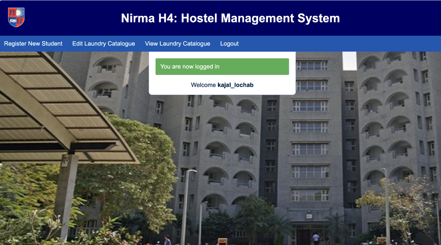

# Hostel-Management-System

A straightforward hostel management system featuring 3-4 functional modules that can be easily expanded as required. The code is intentionally basic, designed to serve as a platform for exploration and experimentation with PHP while implementing fundamental database management system (DBMS) concepts.
